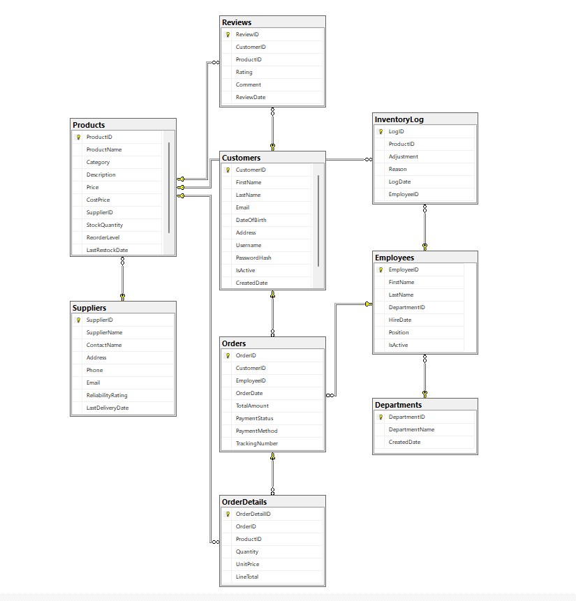

# Retail Database Design (SQL Server)

## Project Overview

Designed a **relational database** for a fictional retail company to manage **customers, inventory, orders, and suppliers**. The focus of the project was on **database modeling, table relationships, and data integrity**, with sample SQL queries demonstrating database functionality.

## Business Context

The company previously managed data using spreadsheets and disconnected applications, resulting in **data inconsistencies, delayed order fulfillment, and challenges in reporting**. This database centralizes and structures data, providing a foundation for efficient retail operations.

## Key Features & Implementation

* **Database Tables**: Customers, Products, Orders, Inventory, Suppliers, Employees, Departments
* **Relationships**: Primary and foreign keys to ensure data integrity
* **Normalization**: Schema designed to **3rd Normal Form (3NF)**
* **Sample SQL Queries**: Demonstrated retrieving data such as:

  * Customers over a certain age with high-value orders
  * Orders linked to suppliers and employees
* **Views and Stored Procedures**: Created for common operations like searching products and retrieving customer order histories

## Tools & Concepts

* Microsoft SQL Server (T-SQL)
* Relational database design
* ER diagram creation
* Database normalization
* Data integrity constraints

## ERD Diagram

The final **Entitly-Relationship Diagram (ERD)** showing all tables and their relationships, highlighting primary keys, foreign keys, and how entities connect.




## SQL Snippets

Creating the  Customers Tables: The following SQL snippet shows how the customer tables was created, including promary key and column definitions.
```sql
CREATE TABLE customers(
    customerID INT PRIMARY KEY
)
```

Creating a View for Customer Orders: This view retrieves each customer's order along with relevant order details.
```sql
CREATE VIEW customersOrders as 
    Select ccustomerID INT PRIMARY KEY
```

Sample Data Retrieval Query: This query retrieves customers with more than 5 orders, demonstrating data aggregation and filtering. 

```sql
CREATE VIEW customersOrders as 
    Select ccustomerID INT PRIMARY KEY
```
```
/er-diagram       # Entity-Relationship diagram
/schema           # SQL scripts to create tables and constraints - DDL.sql. views.sql, procedures.sql, 
/sample-queries   # Sample queries, views, and stored procedures
```


